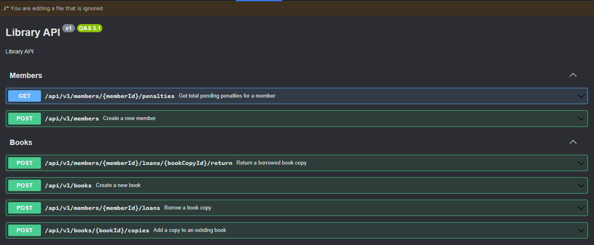
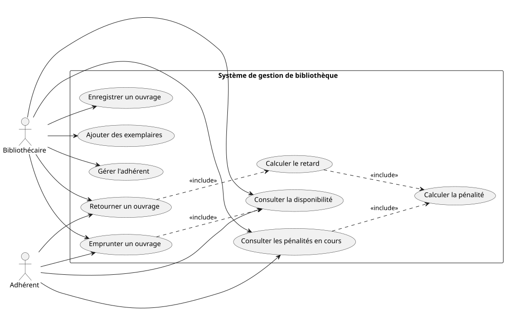

# 📚 Library Management

A library loan management system built with **C# / .NET 10**, Clean Architecture, and Domain-Driven Design.

## Prerequisites

| Tool | Version | Purpose |
|------|---------|---------|
| [.NET 10 SDK](https://dotnet.microsoft.com/download/dotnet/10.0) | 10.0+ | Build and run the solution |
| [Docker Desktop](https://www.docker.com/products/docker-desktop/) | 24.0+ | PostgreSQL via Aspire (run) and Testcontainers (tests) |

Install the Aspire workload if missing:

```bash
dotnet workload install aspire
```

## Quick start (simple)

```powershell
git clone https://github.com/Letsafko/kata.git
cd library-management

dotnet restore

dotnet run --project .\src\AppHost\AppHost.csproj
```

Then open the Aspire dashboard at **https://localhost:15215**.

From the dashboard, open the API resource and use Scalar:

```
https://localhost:5003/scalar/v1
```

If Aspire shows `No trusted development certificate`, run:

```powershell
dotnet dev-certs https --clean
dotnet dev-certs https --trust
```

## API endpoints



## Class use cases



## Project structure

```
src/
├── AppHost/          ← .NET Aspire orchestration (entry point)
├── Api/              ← ASP.NET Core endpoints + ViewModels
├── Application/      ← Use cases: Commands, Queries, Validators
├── Domain/           ← Aggregates, Entities, Value Objects, Domain errors
├── Infrastructure/   ← EF Core, PostgreSQL, repositories
└── SharedKernel/     ← Result<T>, Entity<TId>, ValueObject primitives

test/
├── UnitTests/        ← Domain logic in isolation (no DB, no HTTP)
├── IntegrationTests/ ← Full HTTP → DB slice with Testcontainers
└── Support.SharedTests/ ← Shared fakers and stubs
```

## Architecture

The solution follows **Clean Architecture** with strict layer boundaries:

```
Api → Application → Domain ← Infrastructure
                 ↑
            SharedKernel
```

- **Domain** has zero infrastructure dependencies
- **Application** orchestrates use cases through `IRequestHandler<TRequest, TResponse>`
- A `ValidationDecorator` and `LoggingDecorator` wrap every handler automatically via Scrutor
- All operations return `Result<T>` — no exceptions for expected errors